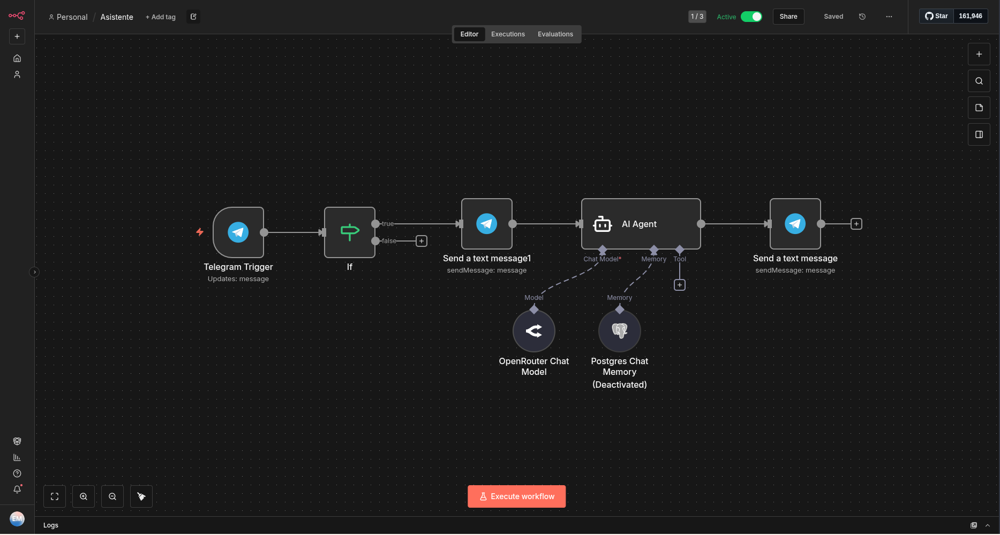

# Instalar n8n en Dokku

Actualizado: 8 de enero de 2026



Esta guía explica cómo implementar [n8n](https://n8n.io/), una herramienta de
automatización de flujo de trabajo extensible, en un host
[Dokku](http://dokku.viewdocs.io/dokku/). Dokku es una PaaS liviana que
simplifica la implementación y administración de aplicaciones mediante Docker.

## Requisitos previos

Antes de continuar, asegúrese de tener lo siguiente:

- Un [host Dokku] en funcionamiento (http://dokku.viewdocs.io/dokku/getting-started/installation/).
- El [complemento PostgreSQL] (https://github.com/dokku/dokku-postgres) instalado en Dokku.
- (Opcional) El [complemento Let's Encrypt] (https://github.com/dokku/dokku-letsencrypt) para certificados SSL.

## Instrucciones de configuración

### 1. Crear la aplicación

Inicia sesión en tu host de Dokku y crea la aplicación `n8n`:

```bash
dokku apps:create n8n
```

### 2. Configurar la aplicación

#### Instalar, crear y vincular el plugin de PostgreSQL

1. Instalar el plugin de PostgreSQL:

```bash
dokku plugin:install https://github.com/dokku/dokku-postgres.git postgres
```

2. Crear un servicio de PostgreSQL:

```bash
dokku postgres:create n8n
```

3. Vincular el servicio de PostgreSQL a la aplicación:

```bash
dokku postgres:link n8n n8n
```

#### Establecer la clave de cifrado

Generar y configurar una clave de cifrado para n8n:

```bash
dokku config:set n8n N8N_ENCRYPTION_KEY=$(echo `openssl rand -base64 45` | tr -d \=+ | cut -c 1-32)
```

#### Configurar la URL del webhook

Configure la URL del webhook para su instancia n8n:

```bash
dokku config:set n8n WEBHOOK_URL=https://n8n.example.com
```

### 3. Configurar el almacenamiento persistente

Para conservar los datos entre reinicios (como nodos de la comunidad, registros, etc.), cree una carpeta en el equipo host y móntela en el contenedor de la aplicación:

```bash
dokku storage:ensure-directory n8n --chown false
# chown 1000:1000 /var/lib/dokku/data/storage/n8n
dokku storage:mount n8n /var/lib/dokku/data/storage/n8n:/home/node/.n8n
```

### 4. Configurar el dominio y los puertos

Configure el dominio de su aplicación para habilitar el enrutamiento:

```bash
dokku domains:set n8n n8n.example.com
```

Asignar el puerto interno `5678` al puerto externo `80`:

```bash
# dokku ports:add n8n http:80:5678

```

### Clonar el repositorio y enviar manualmente

Si prefieres trabajar con el repositorio localmente, puedes clonarlo en tu equipo y enviarlo manualmente a tu servidor Dokku:

1. Clonar el repositorio:

```bash
# Vía HTTPS
git clone https://github.com/edumag/n8n_on_dokku.git
```

2. Agregar tu servidor Dokku como Git remoto:

```bash
git remote add dokku dokku@example.com:n8n
```

3. Enviar la aplicación a tu servidor Dokku:

```bash
git push dokku master
```

Elige el método que mejor se adapte a tu flujo de trabajo.

### 6. Habilitar SSL (Opcional)

Proteja su aplicación con un certificado SSL de Let's Encrypt:

1. Agregue el puerto HTTPS:

```bash
dokku ports:add n8n https:443:5678
```

2. Instale el plugin de Let's Encrypt:

```bash
dokku plugin:install https://github.com/dokku/dokku-letsencrypt.git
```

3. Configure el correo electrónico de contacto para Let's Encrypt:

```bash
dokku letsencrypt:set n8n email you@example.com
```

4. Habilite Let's Encrypt para la aplicación:

```bash
dokku letsencrypt n8n
```

## Conclusión

¡Felicitaciones! Su instancia n8n ya está en funcionamiento. Puedes acceder a él en [https://n8n.example.com](https://n8n.example.com).

Para más información sobre n8n, visita la [documentación oficial](https://docs.n8n.io/).

## Referencias

[n8n](https://github.com/n8n-io/n8n/releases/tag/n8n%401.122.4)
[Dokku](https://github.com/dokku/dokku)
[Maintenance](https://github.com/d1ceward-on-dokku/minio_on_dokku/graphs/commit-activity)

